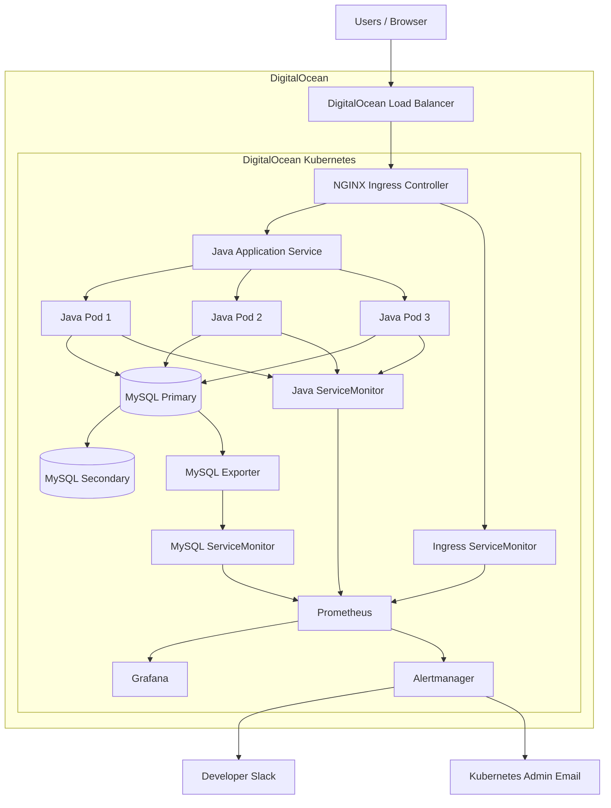

# Java & MySQL Kubernetes Observability Platform

A production-oriented Kubernetes observability project that deploys and monitors a replicated MySQL database, a three-replica Java application, NGINX Ingress, Prometheus, Grafana, and Alertmanager on DigitalOcean Kubernetes.

The platform demonstrates application monitoring, infrastructure visibility, Prometheus metrics discovery, proactive alerting, and team-specific incident notification.

## Architecture



## Project Goals

The project improves visibility into a Java and MySQL workload running in Kubernetes.

The monitoring platform is designed to detect problems before users need to report them, reduce troubleshooting time, and provide enough metrics to identify whether an incident originates from the ingress layer, application layer, database layer, or Kubernetes platform.

## Technology Stack

* DigitalOcean Kubernetes
* Kubernetes
* Docker
* Helm
* Ansible
* Java / Spring Boot
* MySQL
* NGINX Ingress Controller
* Prometheus
* Prometheus Operator
* Alertmanager
* Grafana
* ServiceMonitor
* PrometheusRule
* Slack
* Git
* GitHub
* GitLab

## Repository Structure

```text
.
├── ansible/
│   ├── requirements.yml
│   └── site.yml
├── docs/
│   └── evidence/
├── helm/
│   ├── ingress-nginx-values.yaml
│   ├── kube-prometheus-stack-values.yaml
│   ├── mysql-exporter-values.yaml
│   └── mysql-values.yaml
├── k8s/
│   ├── ingress.yaml
│   └── java-app.yaml
├── monitoring/
│   ├── alertmanager-email.yaml
│   ├── alertmanager-slack.yaml
│   └── prometheus-rules.yaml
├── secrets/
│   └── alertmanager-credentials.example.yaml
├── src/
├── Dockerfile
├── build.gradle
├── settings.gradle
└── README.md
```

## Workload Architecture

The Java application runs with three replicas behind a Kubernetes Service.

NGINX Ingress Controller exposes the application through a DigitalOcean Load Balancer.

MySQL runs using replication architecture with one primary and one secondary instance backed by persistent volumes.

The Java application receives its database connection information from Kubernetes ConfigMap and Secret resources.

## Monitoring Architecture

Prometheus is deployed using the `kube-prometheus-stack` Helm chart.

The monitoring stack includes:

* Prometheus
* Prometheus Operator
* Alertmanager
* Grafana
* kube-state-metrics
* node-exporter

ServiceMonitor resources provide dynamic target discovery.

The platform collects metrics from:

* Kubernetes nodes
* Kubernetes workloads
* NGINX Ingress Controller
* MySQL
* Java application instances

## Alerting

Custom PrometheusRule resources detect:

* NGINX Ingress 4xx response rate above 5%
* all monitored MySQL instances unavailable
* MySQL connection usage approaching capacity
* unusually high Java application request traffic
* MySQL StatefulSet replica mismatch

Alertmanager routes incidents based on labels.

Java and MySQL incidents are routed to the development team's Slack channel.

NGINX and Kubernetes incidents are routed to the Kubernetes administrator by email.

Resolved-alert notifications are also enabled.

## Security

Sensitive credentials are intentionally excluded from source control.

The repository does not contain:

* MySQL passwords
* DigitalOcean API tokens
* Slack webhook URLs
* Gmail App Passwords
* Docker registry credentials
* SSH private keys
* kubeconfig files

Kubernetes Secrets are created separately and referenced by the deployed resources.

The `.gitignore` file prevents common credential and runtime files from being accidentally committed.

## Git Workflow

Development follows a feature-branch workflow:

```text
feature/*
    ↓
develop
    ↓
main
```

Feature branches are merged using:

```bash
git merge --no-ff
```

This preserves clear feature boundaries in Git history.

The repository is pushed to both GitHub and GitLab.

## Validation

Useful validation commands include:

```bash
kubectl get nodes
kubectl get pods -A
kubectl get statefulsets
kubectl get ingress
kubectl get servicemonitors -A
kubectl get prometheusrules -n monitoring
kubectl get alertmanagerconfigs -n monitoring
helm list -A
```

Prometheus targets should report healthy scrape status for the Java application, MySQL exporter, ingress-nginx, Kubernetes components, and monitoring stack.

## Alert Testing

Ingress alert testing is performed by generating HTTP requests against non-existent paths.

Application traffic alerts can be tested by generating controlled HTTP load.

StatefulSet replica mismatch can be tested by temporarily scaling a MySQL StatefulSet below its desired state and restoring it after validation.

All failure simulations should be performed only in lab or non-production environments.

## Evidence

Selected deployment and monitoring evidence is stored under:

```text
docs/evidence/
```

Screenshots are sanitized before being committed so that credentials, tokens, webhooks, email authentication details, and Kubernetes Secrets are never exposed.

## Key Engineering Outcomes

This project demonstrates an end-to-end observability workflow:

```text
Application / Infrastructure
        ↓
Prometheus Metrics
        ↓
Service Discovery
        ↓
Prometheus
        ↓
Alert Rules
        ↓
Alertmanager
        ↓
Slack / Email

Prometheus
        ↓
Grafana
        ↓
Operational Analysis
```

The result is a monitoring platform that provides proactive incident detection, application-level visibility, Kubernetes resource monitoring, and targeted incident notification.
